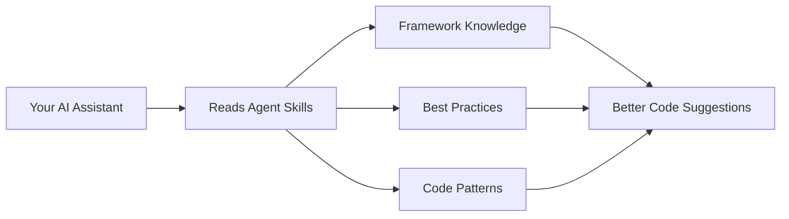

# Agent Skills


---

## What is Agent Skills?

**Agent Skills** is a collection of documentation and specialized agents that supercharge AI coding assistants like Cursor, Claude Code, Windsurf, and Aider.

Think of it as a "knowledge pack" - when you add Agent Skills to your project, your AI assistant gains access to thousands of lines of curated technical expertise about specific frameworks and technologies. This means better code suggestions, fewer mistakes, and more helpful responses.

### Why use it?

- **Generic AI assistants** give you general programming advice
- **AI assistants with Agent Skills** give you framework-specific, best-practice guidance

For example, instead of just getting "how to write a Python function," you get "how to write an Odoo model following Odoo 18.0 conventions with proper ORM usage."

---

## Quick Start

Get started in 30 seconds with NPX (recommended):

```bash
# Add Agent Skills to your current project
npx skills add unclecatvn/agent-skills
```

That's it! Your AI assistant will now have access to all the skills in this repository.

---

## What's Inside?

### Skills - Framework Documentation

In-depth guides written specifically for AI consumption:

| Skill | Description |
|-------|-------------|
| **[Odoo 17.0](skills/odoo-17.0/)** | Odoo 17 development (tree views, direct-expression attrs, `group_operator=`, `_sql_constraints`, JSONB translations, OWL 2.8) |
| **[Odoo 18.0](skills/odoo-18.0/)** | Odoo 18 development (ORM, views, security, OWL, reports, migrations, performance) |
| **[Odoo 19.0](skills/odoo-19.0/)** | Odoo 19 development guide with current conventions |
| **[DTG Base](skills/dtg-base/)** | DTGBase utilities (date/period, timezone, batch, barcode, Vietnamese text) |
| **[Payment Integration](skills/payment-integration/)** | SePay, Polar, Stripe, Paddle, Creem.io and related patterns |
| **[Code Review](skills/code-review/)** | Standards and workflows for automated code review |
| **[Brainstorming](skills/brainstorming/)** | Structured framework for feature ideation and spec review |
| **[Writing Skills](skills/writing-skills/)** | Creating and editing AI skills (structure, evals, quality) |
| **[MCP Builder](skills/mcp-builder/)** | Building Model Context Protocol servers |
| **[Slide (AI Vibe Slides)](skills/slide/)** | Self-contained HTML/React slide decks for fullscreen presentation |
| **[Visual Explainer](skills/visual-explainer/)** | Self-contained HTML for diagrams, diff/plan review, tables, and visual explanations |

### Agents - Autonomous Reviewers

Specialized agents that act as senior technical leads:

| Agent | What it does |
|-------|--------------|
| **[Odoo Code Review](agents/odoo-code-review/SKILL.md)** | Reviews Odoo code with scoring (1–10) and structured feedback |
| **[Odoo Code Tracer](agents/odoo-code-tracer/SKILL.md)** | Traces execution flow from an entry point through the call graph |
| **[Planner](agents/planner.md)** | Breaks down complex features into actionable implementation steps |

### Rules - Coding Standards

Enforced patterns for consistent, secure code:

| Rule | Description |
|------|-------------|
| **[Coding Style](rules/coding-style.md)** | Best practices for naming, imports, and code structure |
| **[Security](rules/security.md)** | Security patterns for enterprise applications |

---

## Project Structure

```
agent-skills/
├── skills/
│   ├── odoo-17.0/             # Odoo 17 guides
│   ├── odoo-18.0/             # Odoo 18 guides
│   ├── odoo-19.0/             # Odoo 19 guides
│   ├── dtg-base/              # DTGBase utilities
│   ├── payment-integration/   # Payment integrations
│   ├── code-review/           # Code review standards
│   ├── brainstorming/         # Ideation and spec review
│   ├── writing-skills/        # Authoring AI skills
│   ├── mcp-builder/           # MCP servers
│   ├── slide/                 # HTML/React slide decks
│   └── visual-explainer/      # HTML diagrams and visual explanations
├── agents/                   # Odoo reviewers + planner
├── rules/                    # Coding style and security
└── lib/                      # Shared assets (e.g. images)
```

---

## Supported IDEs

Agent Skills works with popular AI-powered IDEs:

- **Cursor** - Rules, remote rules, or `npx skills add`
- **Claude Code** - Native skill support
- **Windsurf** - Compatible
- **Aider** - Compatible

---

## How It Works



1. You add Agent Skills to your project
2. Your AI assistant reads the relevant skill files
3. The AI uses this context to provide framework-specific guidance
4. You get better, more accurate code assistance

---

## Stats

| Metric | Value |
|--------|-------|
| Documentation | 55,000+ lines |
| Skill packs | 11 (Odoo 17.0, 18.0, 19.0, DTG Base, Payment, Code Review, Brainstorming, Writing Skills, MCP Builder, Slide, Visual Explainer) |
| Agents | 3 (Odoo Code Review, Odoo Code Tracer, Planner) |
| License | MIT |

---

## Contributing

We welcome contributions! Here's how you can help:

- **Add new skills** - Create documentation for other frameworks
- **Improve existing docs** - Fix errors, add examples
- **Create agents** - Build specialized reviewers or planners
- **Report issues** - Let us know what's missing or broken

Open an issue or discussion on GitHub if you want to propose changes or new skills.

---

## Links

- [Issues](https://github.com/unclecatvn/agent-skills/issues)
- [Discussions](https://github.com/unclecatvn/agent-skills/discussions)
- [Releases](https://github.com/unclecatvn/agent-skills/releases)

---

_If you find this project helpful, please consider giving it a star!_

[](https://star-history.com/#unclecatvn/agent-skills&Date)
