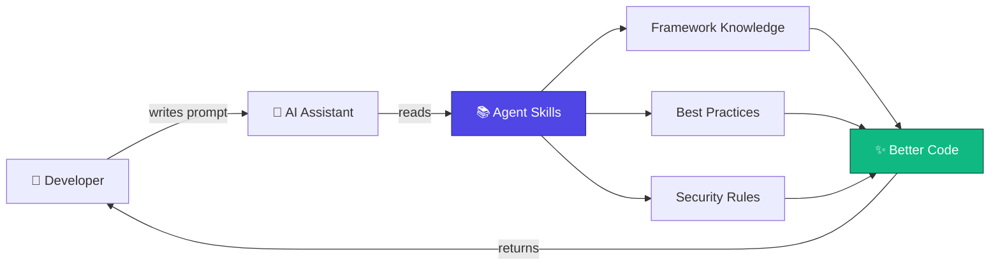

<div align="center">

# Agent Skills


**Curated AI skill packs for Odoo, payments, and MCP — 55k+ lines of framework expertise for your AI coding assistant.**

[](https://www.npmjs.com/package/@unclecat/agent-skills-cli)
[](https://www.npmjs.com/package/@unclecat/agent-skills-cli)
[](LICENSE)
[](https://github.com/unclecatvn/agent-skills/stargazers)
[](https://github.com/unclecatvn/agent-skills/commits/main)
[](https://github.com/unclecatvn/agent-skills/pulls)
[](https://nodejs.org)

</div>

---

## Table of Contents

- [What is Agent Skills?](#what-is-agent-skills)
- [Why use it?](#why-use-it)
- [Quick Start](#quick-start)
- [Real-World Example](#real-world-example)
- [What's Inside?](#whats-inside)
  - [Skills — Framework Documentation](#skills--framework-documentation)
  - [Agents — Autonomous Reviewers](#agents--autonomous-reviewers)
  - [Rules — Coding Standards](#rules--coding-standards)
- [Project Structure](#project-structure)
- [Supported IDEs](#supported-ides)
- [How It Works](#how-it-works)
- [Stats](#stats)
- [Contributing](#contributing)
- [Links](#links)

---

## What is Agent Skills?

**Agent Skills** is a collection of documentation and specialized agents that supercharge AI coding assistants like Cursor, Claude Code, Windsurf, and Aider.

Think of it as a **"knowledge pack"** — when you add Agent Skills to your project, your AI assistant gains access to thousands of lines of curated technical expertise about specific frameworks and technologies. This means better code suggestions, fewer mistakes, and more helpful responses.

---

## Why use it?

| Without Agent Skills | With Agent Skills |
|---|---|
| Generic "how to write a Python function" | Framework-specific "how to write an Odoo 18 model with proper ORM patterns" |
| AI guesses at framework conventions | AI follows documented best practices |
| You re-explain project context every session | Context lives in the repo — AI reads it automatically |
| Subtle bugs from outdated or mixed-version advice | Version-pinned guides (Odoo 17 / 18 / 19) |
| Generic security suggestions | Enforced security rules for enterprise applications |

---

## Quick Start

Get started in 30 seconds with NPX:

```bash
# Add Agent Skills to your current project
npx skills add unclecatvn/agent-skills
```

That's it! Your AI assistant will now have access to all the skills in this repository.

---

## Real-World Example

**Prompt:**
> *"Add a computed field `total_with_tax` to `sale.order` that sums line totals plus VAT."*

<table>
<tr>
<th>Without Agent Skills</th>
<th>With Agent Skills</th>
</tr>
<tr>
<td valign="top">

```python
# Generic guess — may use
# wrong API for your Odoo version
total_with_tax = fields.Float(
    compute='_compute_total'
)

def _compute_total(self):
    for rec in self:
        rec.total_with_tax = sum(
            l.price * 1.1
            for l in rec.order_line
        )
```

</td>
<td valign="top">

```python
# Odoo conventions (17 / 18 / 19):
# Monetary + @api.depends + store
total_with_tax = fields.Monetary(
    compute='_compute_total_with_tax',
    store=True,
    currency_field='currency_id',
)

@api.depends('order_line.price_total')
def _compute_total_with_tax(self):
    for order in self:
        order.total_with_tax = sum(
            order.order_line.mapped('price_total')
        )
```

</td>
</tr>
</table>

---

## What's Inside?

### Skills — Framework Documentation

In-depth guides written specifically for AI consumption:

| Skill | Description |
|-------|-------------|
| **[Odoo 17.0](skills/odoo-17.0/)** | Odoo 17 development (tree views, direct-expression attrs, `group_operator=`, `_sql_constraints`, JSONB translations, OWL 2.8) |
| **[Odoo 18.0](skills/odoo-18.0/)** | Odoo 18 development (ORM, views, security, OWL, reports, migrations, performance) |
| **[Odoo 19.0](skills/odoo-19.0/)** | Odoo 19 development guide with current conventions |
| **[DTG Base](skills/dtg-base/)** | DTGBase utilities (date/period, timezone, batch, barcode, Vietnamese text) |
| **[Payment Integration](skills/payment-integration/)** | SePay, Polar, Stripe, Paddle, Creem.io and related patterns |
| **[Code Review](skills/code-review/)** | Standards and workflows for automated code review |
| **[Brainstorming](skills/brainstorming/)** | Structured framework for feature ideation and spec review |
| **[Writing Skills](skills/writing-skills/)** | Creating and editing AI skills (structure, evals, quality) |
| **[MCP Builder](skills/mcp-builder/)** | Building Model Context Protocol servers |
| **[Slide (AI Vibe Slides)](skills/slide/)** | Self-contained HTML/React slide decks for fullscreen presentation |

### Agents — Autonomous Reviewers

Specialized agents that act as senior technical leads:

| Agent | What it does |
|-------|--------------|
| **[Odoo Code Review](agents/odoo-code-review/SKILL.md)** | Reviews Odoo code with scoring (1–10) and structured feedback |
| **[Odoo Code Tracer](agents/odoo-code-tracer/SKILL.md)** | Traces execution flow from an entry point through the call graph |
| **[Planner](agents/planner.md)** | Breaks down complex features into actionable implementation steps |

### Rules — Coding Standards

Enforced patterns for consistent, secure code:

| Rule | Description |
|------|-------------|
| **[Coding Style](rules/coding-style.md)** | Best practices for naming, imports, and code structure |
| **[Security](rules/security.md)** | Security patterns for enterprise applications |

---

## Project Structure

```
agent-skills/
├── skills/
│   ├── odoo-17.0/             # Odoo 17 guides
│   ├── odoo-18.0/             # Odoo 18 guides
│   ├── odoo-19.0/             # Odoo 19 guides
│   ├── dtg-base/              # DTGBase utilities
│   ├── payment-integration/   # Payment integrations
│   ├── code-review/           # Code review standards
│   ├── brainstorming/         # Ideation and spec review
│   ├── writing-skills/        # Authoring AI skills
│   ├── mcp-builder/           # MCP servers
│   └── slide/                 # HTML/React slide decks
├── agents/                    # Odoo reviewers + planner
├── rules/                     # Coding style and security
├── bin/                       # CLI entry point
└── lib/                       # Shared assets (e.g. images)
```

---

## Supported IDEs

Agent Skills works with popular AI-powered IDEs via `npx skills add`:

- **Cursor** — Rules, remote rules
- **Claude Code** — Native skill support
- **Windsurf** — Compatible
- **Aider** — Compatible

---

## How It Works



1. You add Agent Skills to your project
2. Your AI assistant reads the relevant skill files
3. The AI uses this context to provide framework-specific guidance
4. You get better, more accurate code assistance

---

## Stats

| Metric | Value |
|--------|-------|
| Documentation | 55,000+ lines |
| Skill packs | 10 (Odoo 17.0, 18.0, 19.0, DTG Base, Payment, Code Review, Brainstorming, Writing Skills, MCP Builder, Slide) |
| Agents | 3 (Odoo Code Review, Odoo Code Tracer, Planner) |
| License | MIT |

---

## Contributing

We welcome contributions! Here's how you can help:

- **Add new skills** — Create documentation for other frameworks
- **Improve existing docs** — Fix errors, add examples
- **Create agents** — Build specialized reviewers or planners
- **Report issues** — Let us know what's missing or broken

Open an issue or discussion on GitHub if you want to propose changes or new skills.

[](https://github.com/unclecatvn/agent-skills/graphs/contributors)
[](https://github.com/unclecatvn/agent-skills/issues)
[](https://github.com/unclecatvn/agent-skills/pulls)

---

## Links

- [Issues](https://github.com/unclecatvn/agent-skills/issues)
- [Discussions](https://github.com/unclecatvn/agent-skills/discussions)
- [Releases](https://github.com/unclecatvn/agent-skills/releases)
- [npm Package](https://www.npmjs.com/package/@unclecat/agent-skills-cli)

---

<div align="center">

_If you find this project helpful, please consider giving it a ⭐ star!_

[](https://star-history.com/#unclecatvn/agent-skills&Date)

</div>
